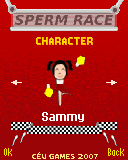
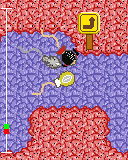
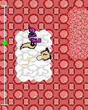
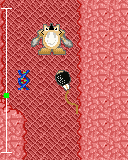

# Sperm Race

A sperm racing game for mobile phones with Java Micro Edition platform.
Game programmed to four groups of mobile phones, with two distinct screen sizes and portrait orientation.
[Link](https://www.getjar.com/categories/adult-apps/games/Sperm-Race-28415) to the GetJar publishing website.

This project was led in Céu Games company by:
- One game designer: [Fabiano Naspolini de Oliveira](https://www.fabricadejogos.net)
- Three software engineers: Santiago Viertel, Tatiane Wagenführ Olivette and [Thalisson Christiano de Almeida](https://github.com/thalisson-ca)
- Two graphic artists: [David Alves Fernandes Neto](https://www.deviantart.com/davidneto) and [Filipe Leal](https://filipegamedev.itch.io)
- One musician: [Thiago Meister](https://instagram.com/thiagomeister86)

## Sample images

From left to right:
- Character selection screen
- Gameplay screen with the __player__ and two more __NPCs__
- The player stuck on the __spermicide__ spread by the enemy __Exterminator__
- The player on the right of a __DNA__ power up and right before of the enemy __Diaphragm__

## Technical information

- __Platform__: J2ME
- __Used library__: Java ME
- __Programming language__: Java
- __Groups of mobile phones__: Sony Ericsson, Motorola, Nokia and Siemens
- __Last code change__: 2009
